# 🤖 Tudee - Your Friendly Task Buddy

Too many tasks?  
Still forgetting things?  
Managing tasks feels boring?

**Don't worry! Tudee is here to help! 🎉**

---

## 💡 What is Tudee?

**Tudee** is a joyful and colorful task management app designed to make organizing your day feel easy and encouraging.

No sign-in required – just open the app and start planning your day instantly!

With its cheerful robot companion, **Tudee** gives you friendly reminders and motivational messages to help you stay productive and positive.

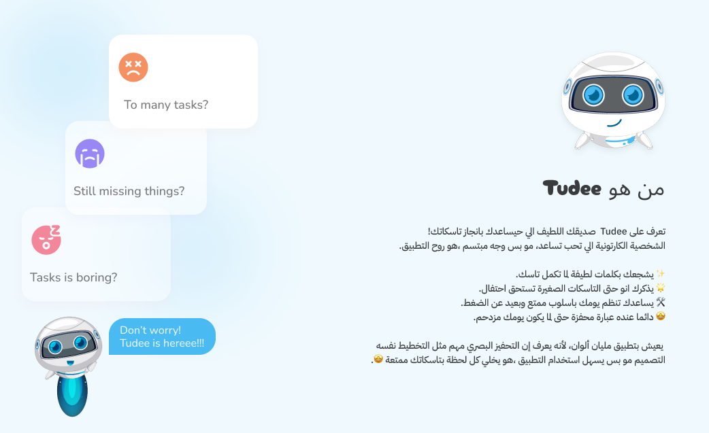

## 🎨 Figma UI Design Prototype
You can explore the full UI prototype of Tudee on Figma using the link below:
[🔗 Open Tudee on Figma](https://www.figma.com/design/Kc0YU5ycMGzo48f0suelUc/Tudee?node-id=0-1&p=f&t=R67j7bPiTzusndXi-0)

The prototype includes:
- Light & Dark UI themes
- Full navigation flow
- Component designs (buttons, task cards, category chips)
- Arabic & English UI preview

---

## 🧭 How does Tudee work?

When the user opens the app, they are immediately shown **today’s tasks**.

- ✅ They can **add a new task** for today using the “+” button.
- 📆 To browse or manage tasks for other days, they can navigate to the **“Tasks” tab** from the bottom navigation bar.
- 🔄 In the Tasks tab, the user can:
  - View tasks grouped by day
  - Filter tasks by status:
    - **To Do**
    - **In Progress**
    - **Done**
  - Add a new task for the currently selected date

Each task is associated with:

- 📂 A **Category** (e.g. Shopping, Cleaning, Worship, Family…)
- 📝 A **Title**
- 📄 An optional **Description**
- 📅 A **Date**
- ⚠️ A **Priority**
- 🏷️ A **Category**
---

## ✨ Key Features

- 🗓 View & manage tasks by **date**
- 🧾 Classify tasks by **status**: To Do / In Progress / Done
- 🏷 Organize tasks by **category**
- 🎨 Colorful UI that reflects task state and category
- 🌙 Supports **dark mode**
- 🌐 Fully supports **Arabic** and **English**
- 🤖 Motivational messages from Tudee based on your task progress
- 🪄 No login required — just open and start working

---

## 🧱 Tech Stack

| Layer | Technology |
|-------|------------|
| Language | Kotlin |
| UI Toolkit | Jetpack Compose |
| Local Storage | Room Database |
| architecture | MVVM |
| unit testing  | Junit 5 & Truth & Mock & Coroutine & Turbine |
| Dependency Injection | Koin |
| Navigation | Navigation Component |

---

## 📱 Platform

- ✅ Android only (for now)

---
## 📽️ Gifs
| Theme Switch Animation | Add Task | Edit Task | Add Category | Edit Category |
| ---------------------- | -------- | --------- | ------------ | ------------- |
|  |  |  |  |  |

---

## 📸 Screenshots

- Home screen
- Add Task
- Task Screen
- Category Screen
- Add Category

🔆 Light Theme
Example:

| Home Screen | Add Task | Task Screen | Category Screen | Add Category |
|-------------|-------------|-------------|-------------|-------------|
| 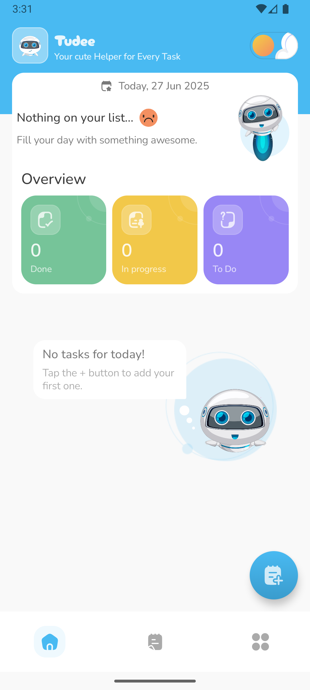 | 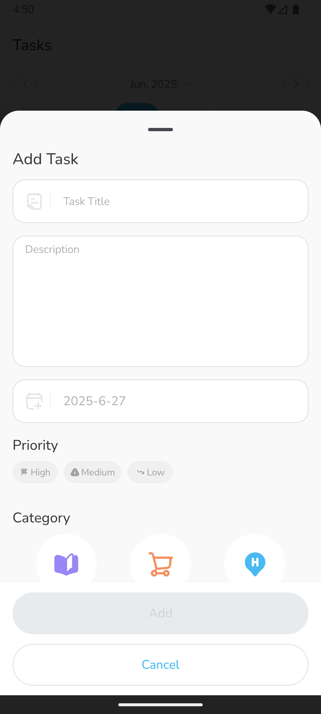 | 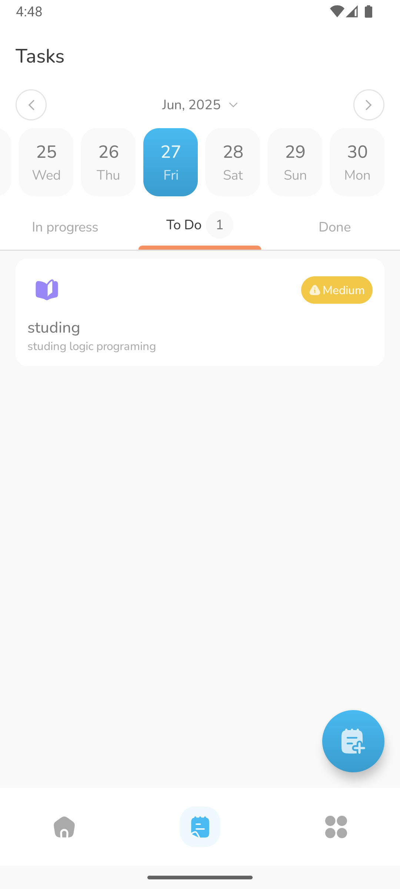 |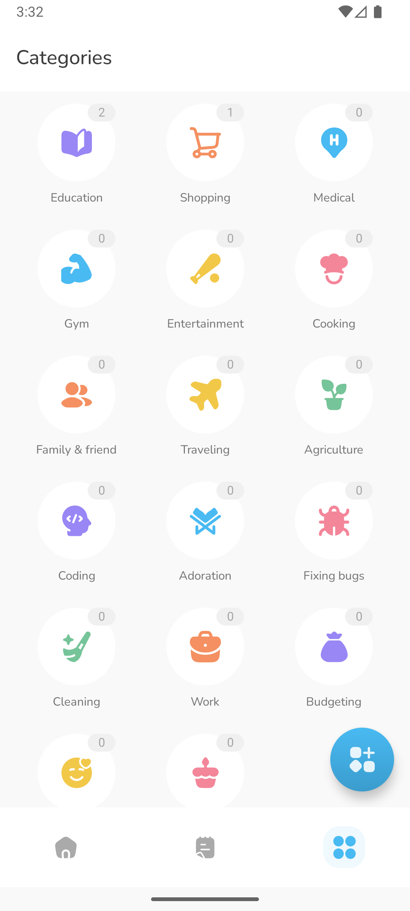 |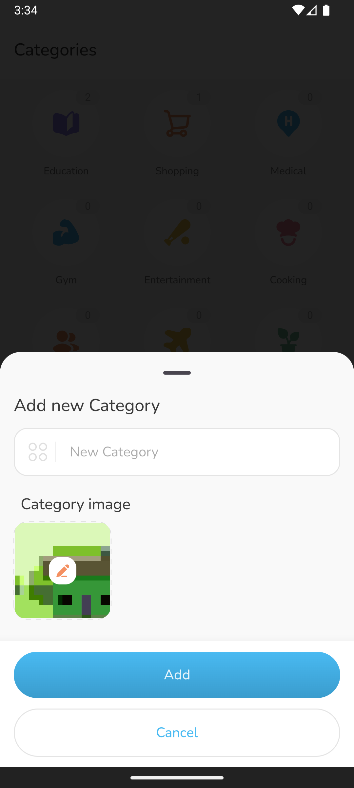 |

---
🌑 Dark Theme

| Home Screen | Add Task | Task Screen | Category Screen | Add Category |
|-------------|-------------|-------------|-------------|-------------|
| 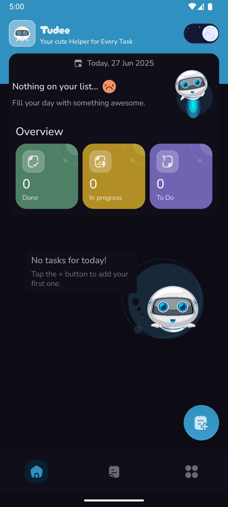 | 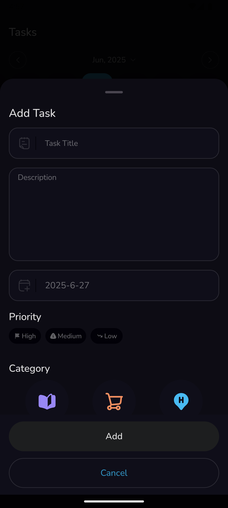 | 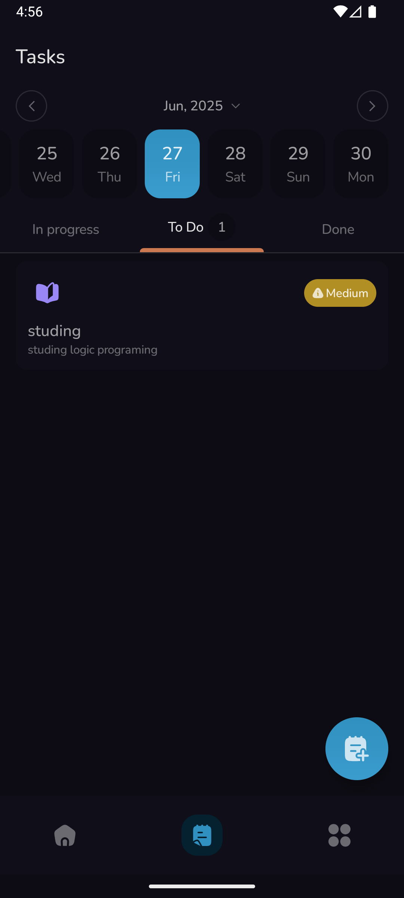 |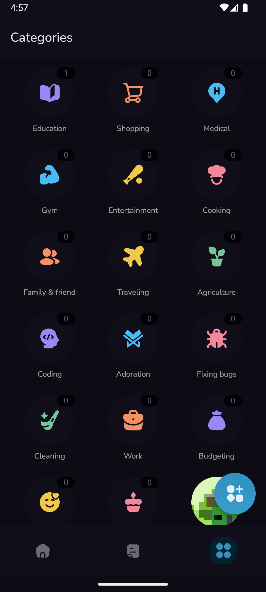 |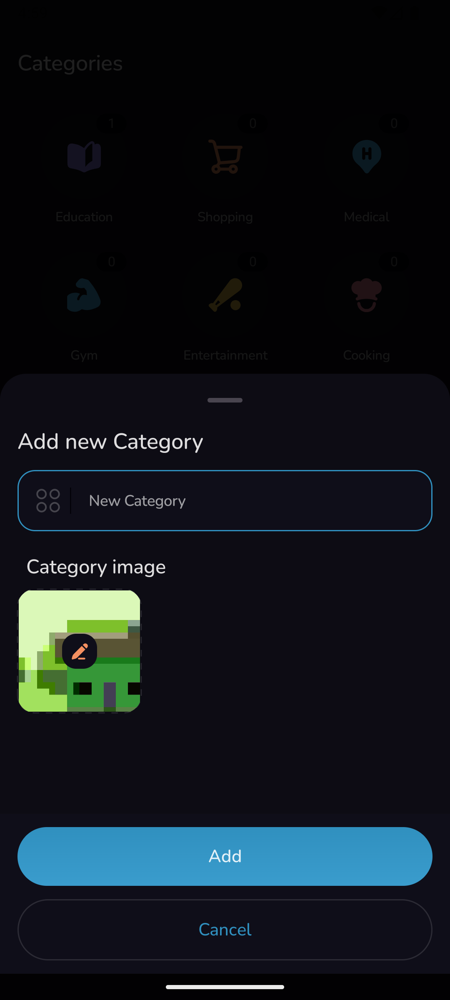 |

---
🗣️ Arabic Language

| Home Screen | Add Task | Task Screen | Category Screen | Add Category |
|-------------|-------------|-------------|-------------|-------------|
| 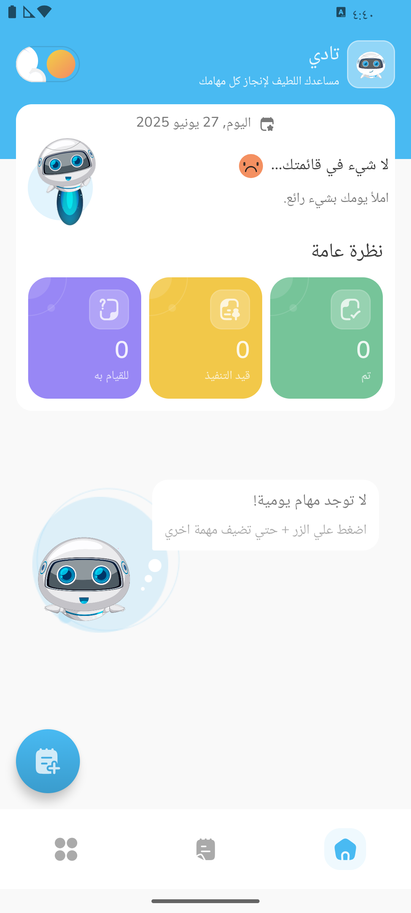 | 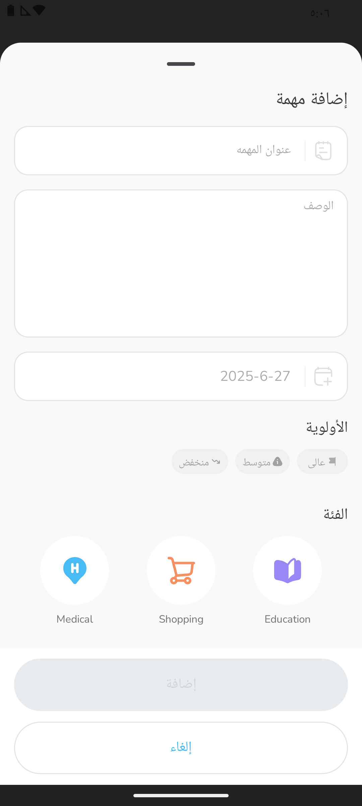 | 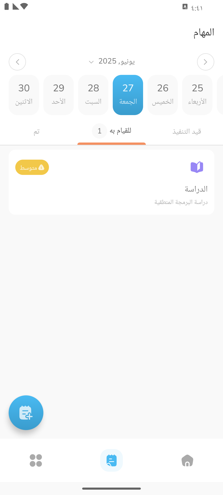 |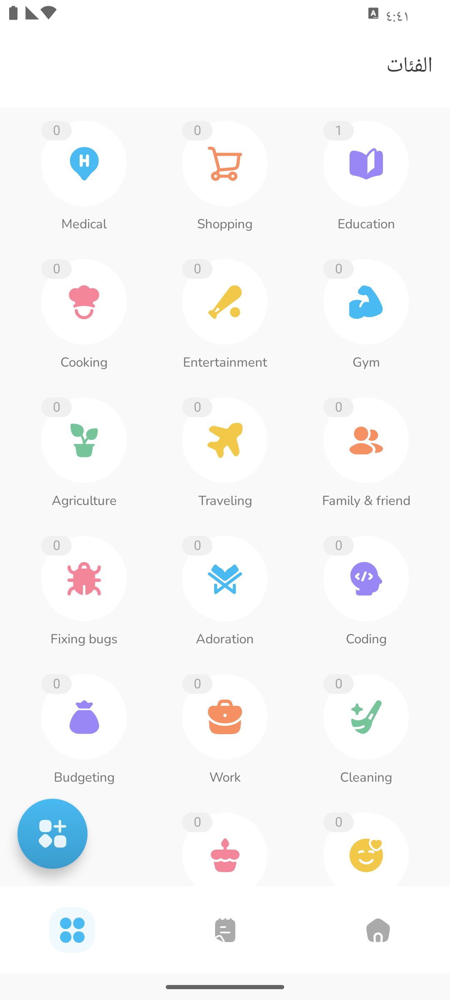 |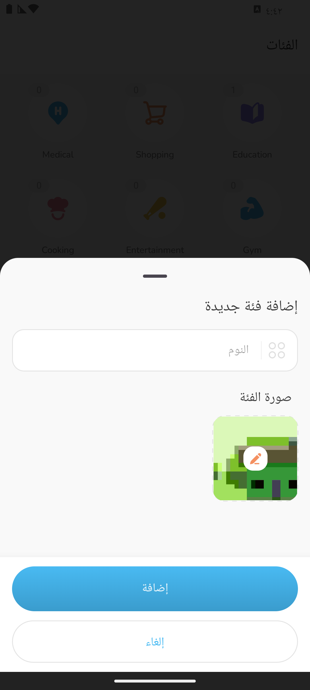 |

---
## 📄 License

Tudee is an open-source project licensed under the MIT License.  
This project was created as part of **The Chance** training program.  
Feel free to use, learn from, and contribute to it.

---

## 🤝 Contributing

We welcome contributions!  
Whether you're a developer, designer, or just someone with a good idea — open an issue or send a pull request.

---

## 👨‍💻 Developed by

- **Paris Squad**

---

